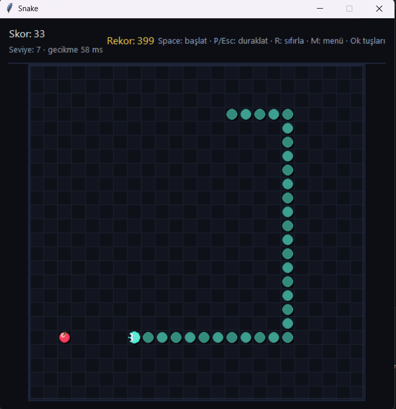

# Snake Game

A simple Snake game built with Python and Tkinter.
## 🎮 Preview


## Features
- Main menu
- Pause and resume
- Score tracking
- High score system
- Increasing speed by level
- Bonus food
- Game over and victory states

## Technologies
- Python
- Tkinter
- Standard Library

## How to Run
1. Make sure Python is installed
2. Run:

```bash
python main.py
